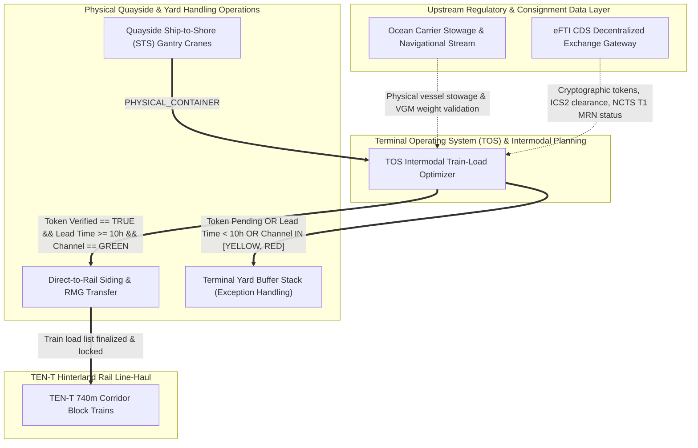

```mermaid
graph TD
    subgraph LAYER_REGULATORY_DATA["Upstream Regulatory & Consignment Data Layer"]
        BLOCK_CARRIER_VOYAGE["Ocean Carrier Stowage & Navigational Stream"]
        BLOCK_EFTI_GATEWAY["eFTI CDS Decentralized Exchange Gateway"]
    end
    subgraph LAYER_TERMINAL_ORCHESTRATION["Terminal Operating System (TOS) & Intermodal Planning"]
        BLOCK_TOS_STOW_PLANNER["TOS Intermodal Train-Load Optimizer"]
    end
    subgraph LAYER_PHYSICAL_EXECUTION["Physical Quayside & Yard Handling Operations"]
        BLOCK_QUAYSIDE_GANTRY["Quayside Ship-to-Shore (STS) Gantry Cranes"]
        BLOCK_RAIL_SIDING_MTS["Direct-to-Rail Siding & RMG Transfer"]
        BLOCK_YARD_BUFFER_STACK["Terminal Yard Buffer Stack (Exception Handling)"]
    end
    subgraph LAYER_CORRIDOR_LINEHAUL["TEN-T Hinterland Rail Line-Haul"]
        BLOCK_CORRIDOR_SHUTTLE["TEN-T 740m Corridor Block Trains"]
    end

    BLOCK_CARRIER_VOYAGE -. "Physical vessel stowage & VGM weight validation" .-> BLOCK_TOS_STOW_PLANNER
    BLOCK_EFTI_GATEWAY -. "Cryptographic tokens, ICS2 clearance, NCTS T1 MRN status" .-> BLOCK_TOS_STOW_PLANNER
    BLOCK_QUAYSIDE_GANTRY == "PHYSICAL_CONTAINER" ==> BLOCK_TOS_STOW_PLANNER
    BLOCK_TOS_STOW_PLANNER == "Token Verified == TRUE && Lead Time >= 10h && Channel == GREEN" ==> BLOCK_RAIL_SIDING_MTS
    BLOCK_TOS_STOW_PLANNER == "Token Pending OR Lead Time < 10h OR Channel IN [YELLOW, RED]" ==> BLOCK_YARD_BUFFER_STACK
    BLOCK_RAIL_SIDING_MTS == "Train load list finalized & locked" ==> BLOCK_CORRIDOR_SHUTTLE
```